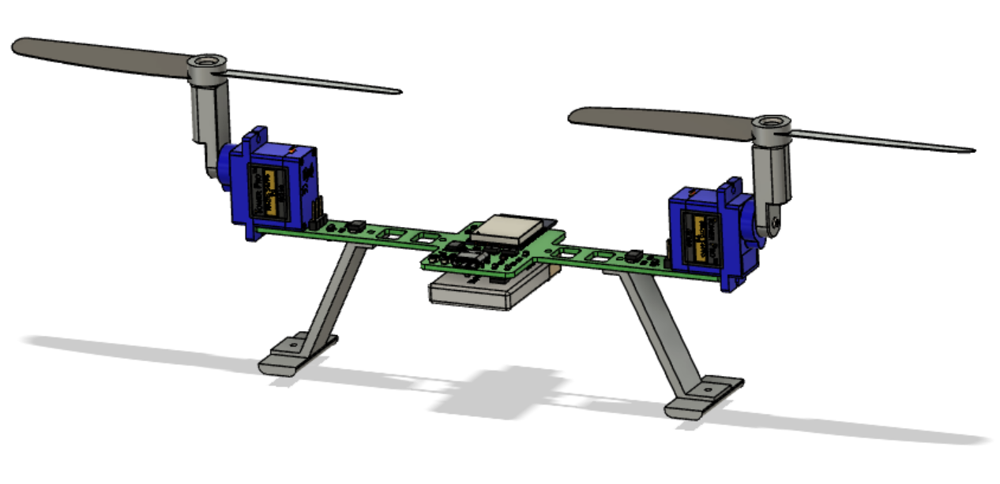
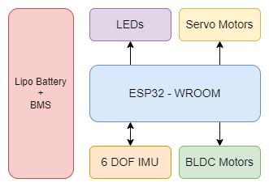
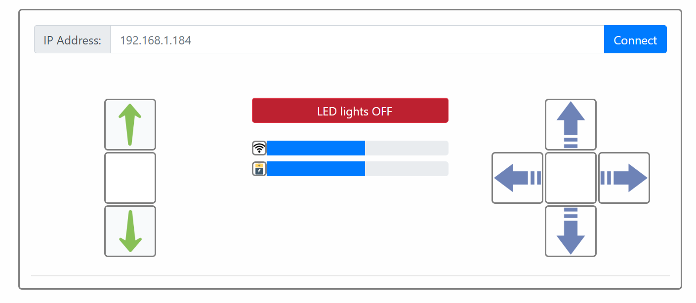

# Bicopter
A bicopter is a type of unmanned aerial vehicle that features two rotors for generating lift and controlling its movement. Unlike traditional quadcopters, which have four rotors, bicopters use only two rotors to achieve flight.

## Assembly
- Uses a PCB that acts at the frame and provides support to all the other components.
- Two motors each connected to a servo motor using a 3D-printed contraption
- The propellers have a mounting boss with a hole diameter equal to the motor shaft diameter
- The servos are attached to the PCB using strong glue 
- The rechargeable lithium-ion (Li-ion) battery is mounted under the PCB using zip ties
- The landing gears are 3D printed and attached to the PCB using screws and nuts

## Hardware block diagram
- ESP32 WROOM: 
	- Control BLDC and servo motors to maintain flight
	- Communicate with the remote controller
- BLDC motor: Provide lift
- Servo motor: Tilt BLDC motors to move the craft
- LED: 
	- Help locate the craft in the dark
	- Indicate battery voltage level 
- LiPo battery + BMS: 
	- Charge the battery 
	- Check battery voltage level
	- Perform power conversion
 

## Application Interface Screenshot
- Connect to the bicopter
- Send flight control information
- Receive and display battery and communication strength information

### Made with lots of ⏱️, 📚 and ☕ by InputBlackBoxOutput
